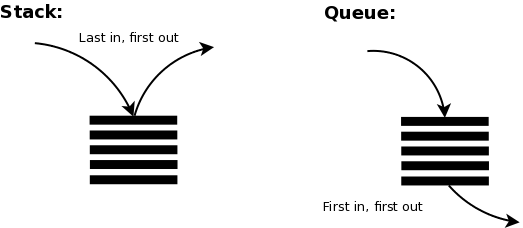

---

marp: true
theme: default
class: invert
paginate: true
author: Rodrigo Alvarez
lang: es-CL
transition: slide
footer: Pila y Cola
math: mathjax

---

# Estructura de datos y algoritmos

Rodrigo Alvarez
rodrigo.alvarez2@mail.udp.cl


---

## Laboratorio 1

---

## Pilas y colas
- **pila**: El único elemento accesible es el ultimo añadido.
- **cola**: El único elemento accesible es el que se añadió más temprano.
- Menos posibilidades de operaciones que una lista pero más eficientes.



---

## Recordatorio: TDA
- **Tipo de dato abstracto** (TDA): Una especificación de un conjunto de datos y las operaciones que pueden ser realizadas sobre esos datos.
  - Describe qué hace, no cómo lo hace.
- No sabemos exactamente cómo se implementa, solo qué hace y qué operaciones podemos hacer.
   - Solo necesitamos entender la idea de la colección de datos y las operaciones que puede realizar.


> las pilas y colas usualmente se implementan con listas enlazadas

---

## Pila (stack)

<small>

- **LIFO**: Last In First Out
- Los elementos son guardados en el orden de inserción
  - No solemos pensar en la posición de los elementos, solo en el último añadido.
- El "cliente" solo puede acceder al último elemento añadido.

<hr />

- Operaciones básicas:
  - push: añadir un elemento
  - pop: quitar el último elemento añadido
  - peek (o top): ver el último elemento añadido

</small>


---

## Pila (stack)


---
## [Class Stack](https://docs.oracle.com/javase/8/docs/api/java/util/Stack.html)

`java.util.Stack`


---

## Class stack

<a href="https://onecompiler.com/embed/java/428jybu4h?theme=dark">
<iframe
 frameBorder="0"
 height="450px"  
 src="https://onecompiler.com/embed/java/428jybu4h?theme=dark" 
 width="100%"
 >
</iframe>
</a>

---

- No se suele iterar sobre una pila.

- Se usa un bucle `while` para vaciar la pila.

```java
  while (!stack.isEmpty()) {
    System.out.println(stack.pop());
  }
```

---

[https://visualgo.net/en/stack](https://visualgo.net/en/stack)

<iframe
 frameBorder="0"
 height="450px"  
 src="https://visualgo.net/en/stack" 
 width="100%"
 >
</iframe>

---

```java

class Stack {
  class Node {
    int data;
    Node next;
    public Node(int data) {
      this.data = data;
      this.next = null;
    }
  }
  Node head;
  public Stack() {
    this.head = null;
  }
  public void push(int e) {
    Node newNode = new Node(e);
    if (head != null) {
      newNode.next = head;
    }
    head = newNode;
  }
  public int pop() {
    int e = head.data;
    head = head.next;
    return e;
  }
  public int peek() {
    return head.data;
  }
}

```

---

## Complejidad de las operaciones de una pila:

- `push`: O(1)
- `pop`: O(1)
- `peek`: O(1)

---


## Cola (queue)

<small>

- **FIFO**: First In First Out
- Los elementos son guardados en el orden de inserción y no suelen tener indices.
- El "cliente" puede añadir elementos al final y examinar/quitar elementos del principio.

<hr />

- Operaciones básicas:
  - enqueue: añadir un elemento al final
  - dequeue: quitar el elemento del principio
  - peek: ver el elemento del principio

</small>


---

## Cola (queue)


---

## [Interface Queue](https://docs.oracle.com/javase/8/docs/api/java/util/Queue.html)

`java.util.Queue`


---

[https://visualgo.net/en/queue](https://visualgo.net/en/queue)

<iframe
 frameBorder="0"
 height="450px"  
 src="https://visualgo.net/en/queue" 
 width="100%"
 >
</iframe>

---

```java
class Queue {
  class Node {
    int data;
    Node next;
    public Node(int data) {
      this.data = data;
      this.next = null;
    }
  }
  Node head, tail;
  public Queue() {
    this.head = this.tail = null;
  }
  public void enqueue(int e) {
    Node newNode = new Node(e);
    if (head == null) {
      head = tail = newNode;
    } else {
      tail.next = newNode;
      tail = newNode;
    }
  }
  public int dequeue() {
    int e = head.data;
    head = head.next;
    return e;
  }
  public int peek() {
    return head.data;
  }
}

```

---

## Complejidad de las operaciones de una cola:

- `enqueue`: O(1)
- `dequeue`: O(1)
- `peek`: O(1)

---

## Ejercicios
- List
  - [Reverse a doubly linked list (easy)](https://www.hackerrank.com/challenges/reverse-a-doubly-linked-list/problem)
  - [Cycle Detection (medium)](https://www.hackerrank.com/challenges/detect-whether-a-linked-list-contains-a-cycle/problem)
  - [Get Node Value (easy)](https://www.hackerrank.com/challenges/get-the-value-of-the-node-at-a-specific-position-from-the-tail/problem)
- Stack
  - [Equal stacks (easy)](https://www.hackerrank.com/challenges/equal-stacks/problem)
  - [Balanced brackets (medium)](https://www.hackerrank.com/challenges/balanced-brackets/problem)
- Queue
  - [Queue using two stacks (medium)](https://www.hackerrank.com/challenges/queue-using-two-stacks/problem)
- 
