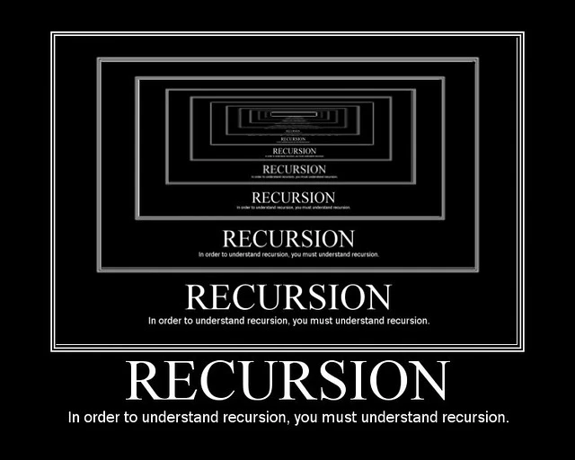

---

marp: true
theme: default
class: invert
paginate: true
author: Rodrigo Alvarez
lang: es-CL
transition: slide
footer: Recursion
math: mathjax

---

# Estructura de datos y algoritmos

Rodrigo Alvarez
rodrigo.alvarez2@mail.udp.cl


---

## Solemne 1:
Jueves 25 de abril
<small>13:30 - 15:45 </small>

---

## [Nerdearla](https://nerdear.la/)
[Registro](https://reg.nerdear.la?invited_by=MzAwMDU1)

---

## Recursión
> La recursión o recursividad es la posibilidad que tiene un cierto tipo de unidad o proceso de contenerse o aplicarse a sí mismo indefinidamente.




---

## Recursión

 - Una manera de diseñar soluciones a problemas mediante "dividir y conquistar".
   - Un problema se divide en subproblemas más pequeños.
- Semanticamente es una técnica de programación en la que una función se llama a sí misma.
- La recursión es una forma de iteración.
  - En programación la meta es **no** tener una recursión infinita:
    - Se debe tener un caso base que termine la recursión.
    - Se debe avanzar hacia el caso base en cada llamada recursiva.

---

## Algoritmos iterativos
- Las instrucciones de bucle (`for, while`) llevan a algoritmos iterativos.
- Capturan la computación en un conjunto de variables de estado que se actualizan en cada iteración a través de un bucle.

---

## Factorial - solución iterativa
- un factorial es el producto de todos los números enteros positivos desde `n` hasta `1`.

- el estado sería:
  -  un contador `i` que va de `n` a `1`
  -  un acumulador `result` que se multiplica por `i` en cada iteración.

```java
int factorial(int n) {
  int result = 1;
  for (int i = n; i > 0; i--) {
    result *= i;
  }
  return result;
}
```

---

## Factorial - solución recursiva

- **Paso recursivo:**
  - Pensar en como reducir el problema a un problema más pequeño y manejable. 
    - $n! = n * (n-1)!$
- **Caso base:**
  - Seguir reduciendolo hasta que el problema pueda ser resuelto directamente.
    - cuando $n = 0 \rightarrow 0! = 1$

$n! = n * (n - 1) * (n - 2) * ... * 1$
$= n * (n - 1)!$
$= n * (n - 1)  * (n - 2)!$
$...$ 

---

## Factorial - solución recursiva
  
```java 
int factorial(int n) {
  if (n == 0) { // caso base
    return 1;
  }
  return n * factorial(n - 1); // paso recursivo
}
```

---

## Factorial - solución recursiva con stack simulado
  
```java
int factorial(int n) {
  Stack<Integer> stack = new Stack<>();
  while (n > 0) {
    stack.push(n);
    n--;
  }
  int result = 1;
  while (!stack.isEmpty()) {
    result *= stack.pop();
  }
  return result;
}
```

---

## Recursión vs Iteración
- La recursión suele ser más lenta que la iteración.
  - Cada llamada recursiva necesita almacenar información en la pila de llamadas.
  - La pila de llamadas puede crecer hasta que se alcance el caso base.
  - La recursión puede ser más fácil de entender y escribir que la iteración.

---

## Recursión de cola
- La recursión de cola es una forma especial de recursión en la que la llamada recursiva es la última operación que se realiza.
- Va a depender del compilador si se optimiza la recursión de cola.
  - Java no optimiza la recursión de cola.
  - C++ optimiza la recursión de cola.
- La recursión de cola es más eficiente que la recursión normal:
  - No necesita almacenar información en la pila de llamadas.
  - La pila de llamadas no crece.

---

## Factorial - recursión de cola

```java
int f(int n) {
  return factorial(n, 1);
}

int factorial(int n, int acc) {
  if (n == 0) {
    return acc;
  }
  return factorial(n - 1, n * acc);
}

```


---

- [Recursividad](https://youtu.be/YwRjEOFxvO0?si=hV6_LK9LLGtXRUsO)
- [Recursión de cola](https://youtu.be/SIgfSYyWVjo?si=Lh3o2kfYgoBh8LD8)

---

## Ejercicio
[Revertir lista enlazada](https://www.hackerrank.com/challenges/one-month-preparation-kit-reverse-a-linked-list/problem)