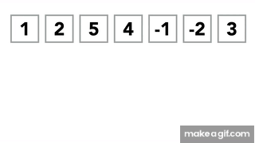
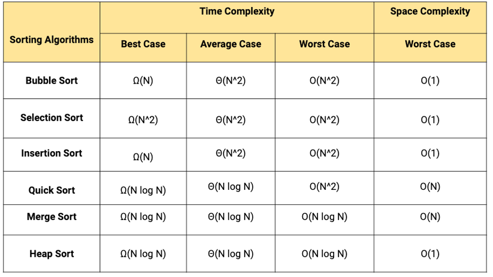

---

marp: true
theme: default
class: invert
paginate: true
author: Rodrigo Alvarez
lang: es-CL
transition: slide
footer: Merge sort y quick sort
math: mathjax

---

# Estructura de datos y algoritmos

Rodrigo Alvarez
rodrigo.alvarez2@mail.udp.cl

---

## Divide y vencerás

- **Divide y vencerás** es un paradigma de diseño de algoritmos.
- Consiste en dividir un problema en subproblemas más pequeños.
- Resolver los subproblemas de forma recursiva.
- Combinar las soluciones de los subproblemas para resolver el problema original.

---

## Merge sort

- **Merge sort** consiste en dividir la lista en dos mitades recursivamente.
- El caso base es una lista de un elemento.
- Luego se van combinando las dos listas ordenadas hasta obtener la lista ordenada completa.
- Complejidad: $O(n \log n)$


---

## Merge sort

<small>

```java
public static int[] mergeSort(int[] arr) {
    if (arr.length <= 1) return arr;
    int mid = arr.length / 2;
    int[] left = mergeSort(Arrays.copyOfRange(arr, 0, mid));
    int[] right = mergeSort(Arrays.copyOfRange(arr, mid, arr.length));
    int i = 0, j = 0, k = 0;
    while (i < left.length && j < right.length) {
        if (left[i] < right[j]) {
            arr[k++] = left[i++];
        } else {
            arr[k++] = right[j++];
        }
    }
    while (i < left.length) {
        arr[k++] = left[i++];
    }
    while (j < right.length) {
        arr[k++] = right[j++];
    }
    return arr;
}
```

</small>

---

## Quick sort

- **Quick sort** consiste en elegir un pivote y dividir la lista en dos partes
- Los elementos menores al pivote van a la izquierda y los mayores a la derecha.
- Luego se ordenan las dos partes recursivamente.
- Complejidad: $O(n^2)$ en el peor caso, $\theta(n \log n)$ en promedio.




---

## Quick sort

<small>

```java
public static int[] quickSort(int[] arr) {
    return quickSort(arr, 0, arr.length - 1);
}

private static int[] quickSort(int[] arr, int low, int high) {
    if (low < high) {
        int pi = partition(arr, low, high);
        quickSort(arr, low, pi - 1);
        quickSort(arr, pi + 1, high);
    }
    return arr;
}

private static int partition(int[] arr, int low, int high) {
    int pivot = arr[high];
    int i = low - 1;
    for (int j = low; j < high; j++) {
        if (arr[j] < pivot) {
            i++;
            int temp = arr[i];
            arr[i] = arr[j];
            arr[j] = temp;
        }
    }
    int temp = arr[i + 1];
    arr[i + 1] = arr[high];
    arr[high] = temp;
    return i + 1;
}

```

</small>


---


---

## Referencias

- [Sorting algorithms](https://youtu.be/WaNLJf8xzC4?si=6twJAiryzFnsEN7f)
- [Divide y vencerás](https://youtu.be/UxtAqHOb8aw?si=8nsGhXy10kASLvYa)
- [Merge sort](https://youtu.be/ACFZn_xQcz8?si=u5jWzoiM668-AghK)
- [Quick sort](https://youtu.be/UrPJLhKF1jY?si=mfTZwq9hmyZWcGDg)
- [Quick sort computerphile](https://youtu.be/XE4VP_8Y0BU?si=_n9Xa08HZGmK4upb)