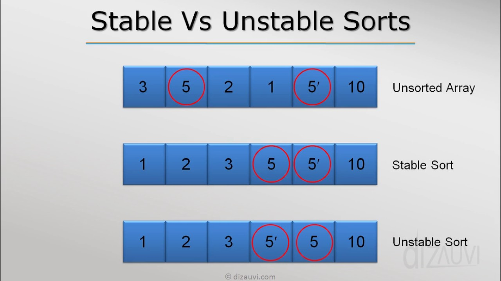
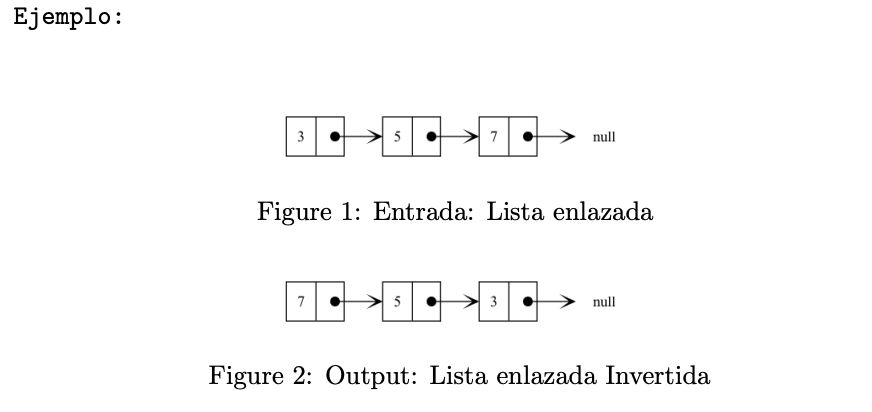
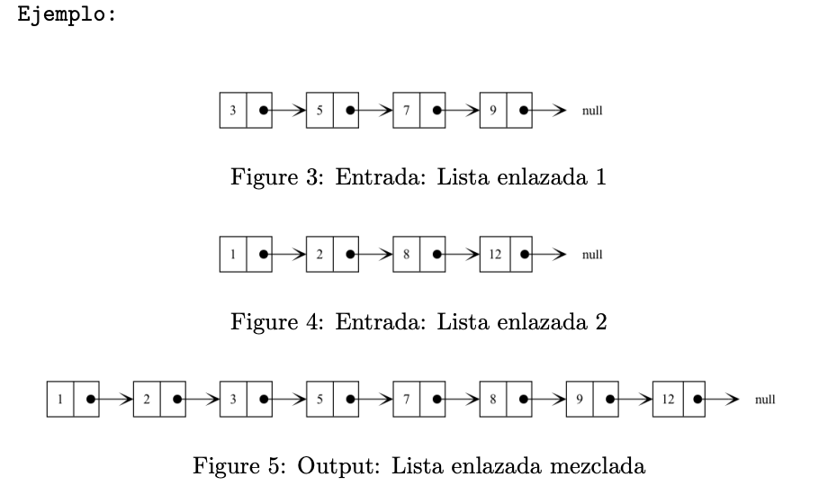

---

marp: true
theme: default
class: invert
paginate: true
author: Rodrigo Alvarez
lang: es-CL
transition: slide
footer: Propiedades de algoritmos de ordenamiento y ejercicios solemne
math: mathjax

---

# Estructura de datos y algoritmos

Rodrigo Alvarez
rodrigo.alvarez2@mail.udp.cl

---

## Algoritmos de ordenamiento estables VS inestables

- **Algoritmos estables**: mantienen el orden relativo de los elementos iguales.
- **Algoritmos inestables**: no garantizan el orden relativo de los elementos iguales.



---

## Algoritmos de ordenamiento estables VS inestables

| Algoritmo | Estabilidad |
|-----------|------------ |
| Bubble sort | Estable |
| Selection sort | Inestable |
| Insertion sort | Estable |
| Merge sort | Estable |
| Quick sort | Inestable |

---

## Algoritmos in-place VS no in-place

- **Algoritmos in-place**: no requieren memoria adicional.
- **Algoritmos no in-place**: requieren memoria adicional.
- La mayoría de los algoritmos de ordenamiento son in-place.

---

## Algoritmos de ordenamiento in-place VS no in-place

| Algoritmo | In-place |
|-----------|----------|
| Bubble sort | Sí |
| Selection sort | Sí |
| Insertion sort | Sí |
| Merge sort | No |
| Quick sort | Sí |

---

# Ejercicios

---

## Ejercicio 1

<small style="font-size: 22px;">

Sea una lista enlazada definida:
```java
class LinkedList {
  class Node {
      int data;
      Node next;
  }
  Node head;
}
```
Diseñe el método invertir lista, que recibe el head de una lista para modicarla y dejarla en orden inverso.
1. Diseñe el método invertir de forma iterativa.
2. Diseñe el método invertir de forma recursiva.

</small>



---

## Ejercicio 2


<small style="font-size: 22px;">

Sean dos listas enlazadas, ambas definidas:

```java
class LinkedList {
  class Node {
    int value;
    Node next;
  }
  Node head;
}
```

Diseñe el método mezclar listas enlazadas ordenadas de manera ascendente, que recibe como entrada los head de dos listas enlazadas y retorna como salida el head de una nueva lista enlazada que mezcla ambas listas de manera ordenada.

</small>




---

## Ejercicio 3

<small style="font-size: 18px;">

Diseñe un algoritmo que recibe como entrada un string que puede estar compuesto por los siguientes
caracteres:

```
[ ] ( ) { }
```

Como output el algoritmo debe retornar un booleano que describa si la expresión formada es válida,
es decir que para cada símbolo de apertura, existe un simbolo de cierre en el lugar correcto.

```
Ejemplo 1:
  Input:
    { ( ) [ ] }
  Output:
    true
Ejemplo 2:
  Input:
    { } ( ) [ ( ]
  Output:
    false
Ejemplo 3:
  Input:
    { } ( [ { } [ ] ( { [ ] } ) ] )
  Output:
    true
```

</small>