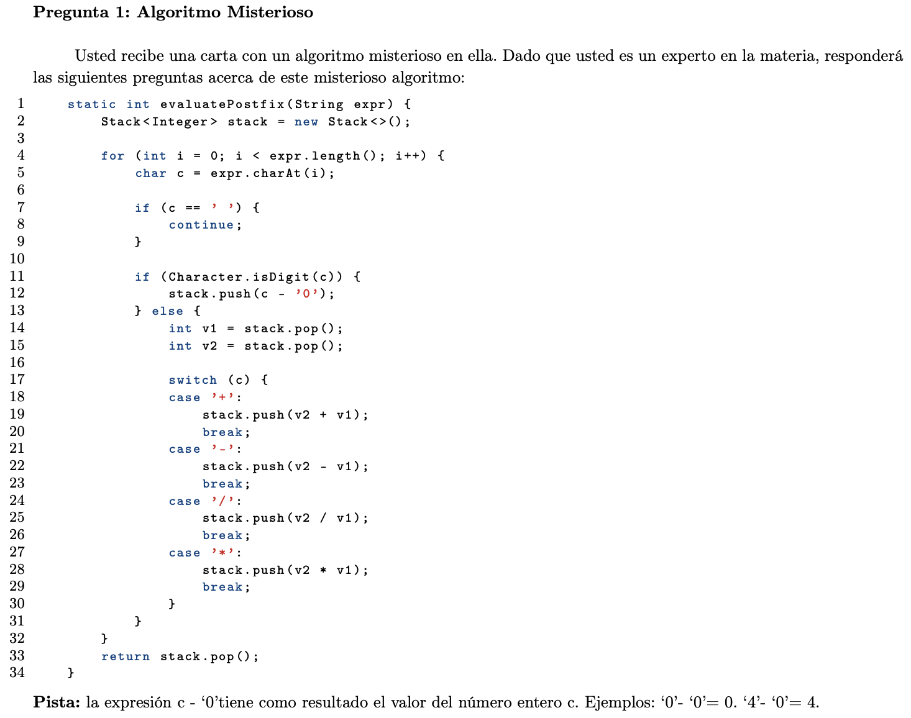
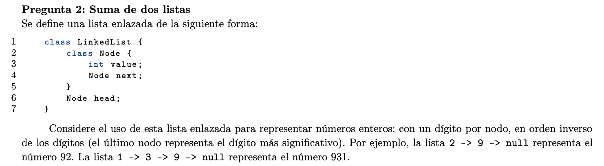
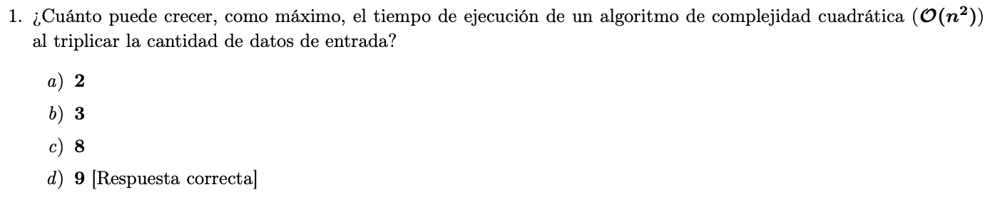
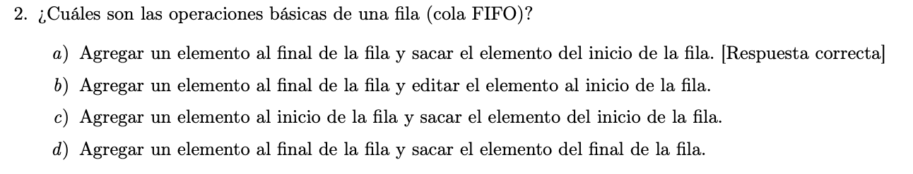
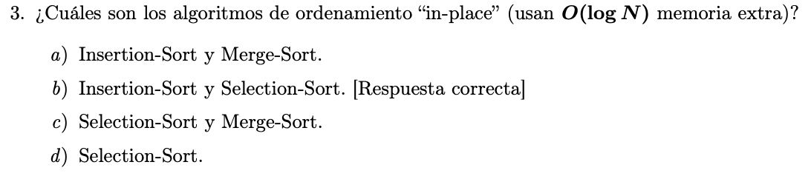
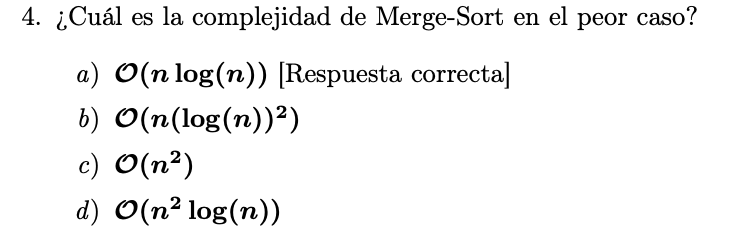
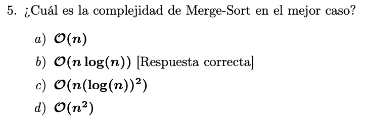

---

marp: true
theme: default
class: invert
paginate: true
author: Rodrigo Alvarez
lang: es-CL
transition: slide
footer: Revisión solemne
math: mathjax

---

# Estructura de datos y algoritmos

Rodrigo Alvarez
rodrigo.alvarez2@mail.udp.cl

---

## Encuesta

Código ramo: `2006`
Sección: `03`


---



---


Para cada uno de los siguientes casos de prueba, indique el valor retornado por el método al recibir el caso como argumento:

- `5 5 +`
- `6 6 / 9 *`
- `2 4 * 2 2 * +`

---


Para cada uno de los siguientes casos de prueba, indique el valor retornado por el método al recibir el caso como argumento:

- `5 5 +`   `= 10`
- `6 6 / 9 *` `= 9`
- `2 4 * 2 2 * +` `=12`


---


En base a sus observaciones del punto anterior, explique en no más de 3 lineas, ¿De qué forma el algoritmo modifica los datos que recibe?


---


En base a sus observaciones del punto anterior, explique en no más de 3 lineas, ¿De qué forma el algoritmo modifica los datos que recibe?


<small>

`El algoritmo recibe como input una expresión aritmética en notación de postfijo (los operadores van después del operando) y retorna el resultado de esta.`

</small>

---


<small style="font-size:20px">

Analice el algoritmo en cuestión y describa su tiempo de ejecución en términos de O(f(n)), dónde n es el largo del arreglo recibido como argumento y f es una función matemática propuesta por usted. Fundamente su respuesta.

</small>

---


<small style="font-size:20px">

Analice el algoritmo en cuestión y describa su tiempo de ejecución en términos de O(f(n)), dónde n es el largo del arreglo recibido como argumento y f es una función matemática propuesta por usted. Fundamente su respuesta.


</small>

<small style="font-size:20px">

`El tiempo de ejecución es O(N).`
`El algoritmo itera en la expresión aritmética de manera lineal, de izquierda a derecha. Realizando operaciones constantes en cada iteración.`

</small>

---




---


<small>

Defina un método suma, el cual recibe como argumentos los head de dos listas que representan números y retorna el head de una nueva lista, la cual representa la suma de los dos números recibidos.

</small>

---

```java
static LinkedList.Node suma(LinkedList.Node n1, LinkedList.Node n2) {
  LinkedList.Node dummyHead = new LinkedList.Node();
  LinkedList.Node current = dummyHead;
  int carry = 0;
  while (n1 != null || n2 != null) {
    int x, y;
    if (n1 == null)
      x = 0;
    else
      x = n1.value;
    if (n2 == null)
      y = 0;
    else
      y = n2.value;
    int sum = carry + x + y;
    carry = sum / 10;
    current.next = new LinkedList.Node();
    current.next.value = sum % 10;
    current = current.next;
    if (n1 != null)
      n1 = n1.next;
    if (n2 != null)
      n2 = n2.next;
  }
  if (carry > 0) {
    current.next = new LinkedList.Node();
    current.next.value = carry;
  }
  return dummyHead.next;
}
```

---


<small style="font-size:20px">

Analice el algoritmo diseñado y describa su tiempo de ejecución en términos de O(f(n, m)), dónde n y m son la cantidad de datos en la primera y segunda lista, respectivamente, y f es una función matemática propuesta por usted. Fundamente su respuesta.

</small>

---


<small style="font-size:16px">

Analice el algoritmo diseñado y describa su tiempo de ejecución en términos de O(f(n, m)), dónde n y m son la cantidad de datos en la primera y segunda lista, respectivamente, y f es una función matemática propuesta por usted. Fundamente su respuesta.

</small>

<small style="font-size:16px"> 


`El algoritmo inicializa una nueva lista y luego itera en ambas listas hasta llegar al final de ambas. En cada iteración:`
- `Se suman los valores de los nodos actuales con el valor del acarreo.`
- `Luego, se obtiene el valor del nuevo nodo calculando el modulo 10 (para obtener solo el digito de unidad del resultado)`
- `Y se actualiza el valor del acarreo dividiendo por 10 (para obtener el digito de la decena del resultado).`
- `Finalmente se agrega el nuevo nodo a la nueva lista.`
`Si después de recorrer ambas listas todavía hay un acarreo pendiente, se agrega un nodo adicional con ese acarreo.`

`El tiempo de ejecución es O(max(n,m)).`

</small>

---



---



---



---



---

