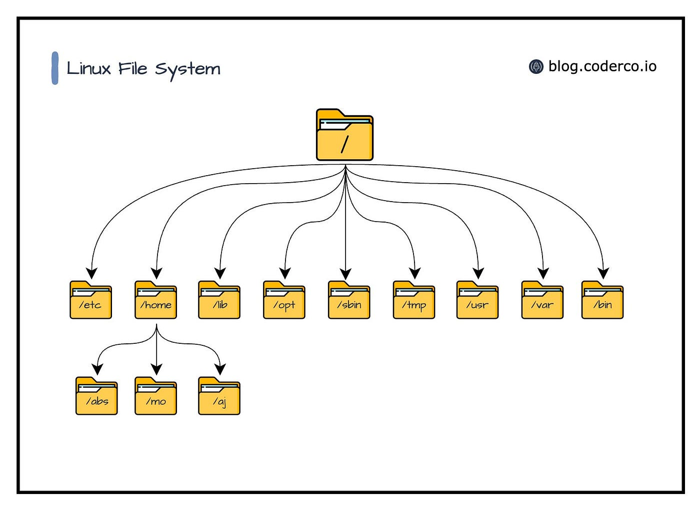
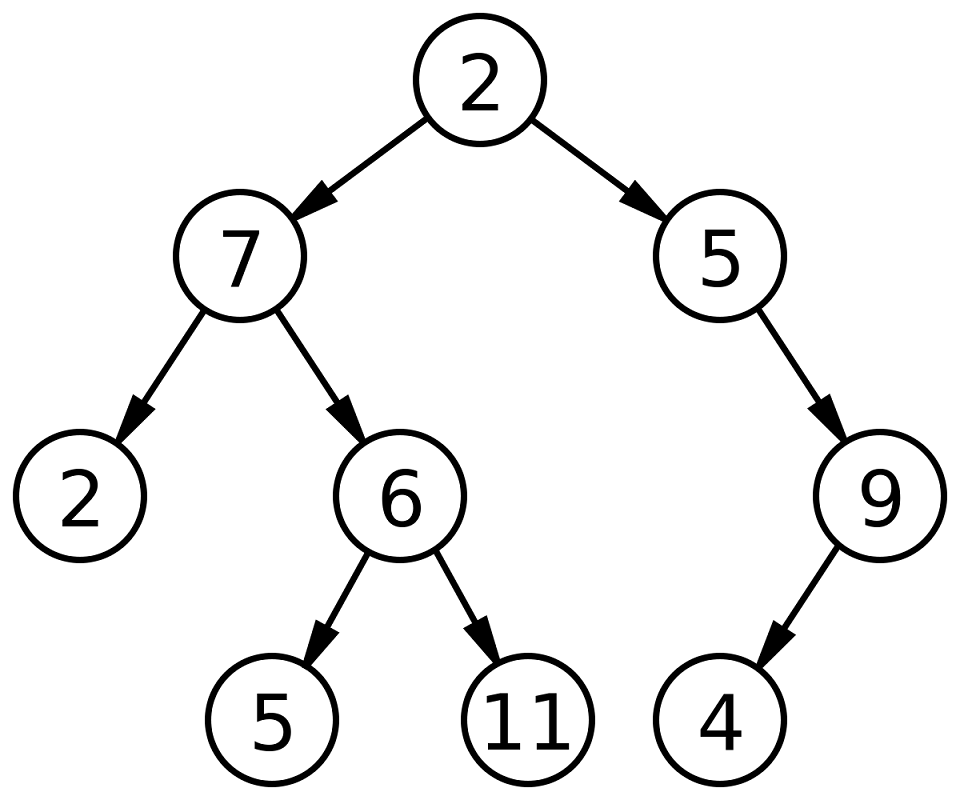
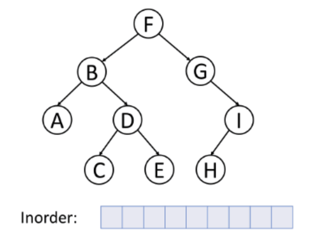
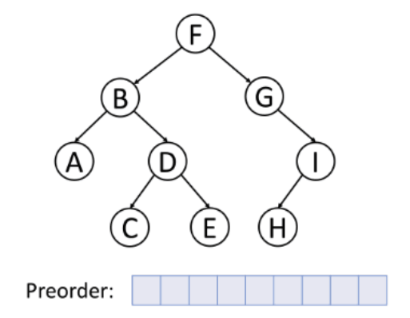
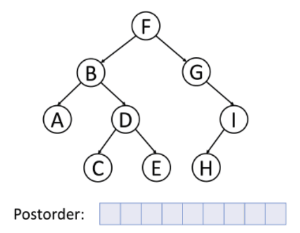
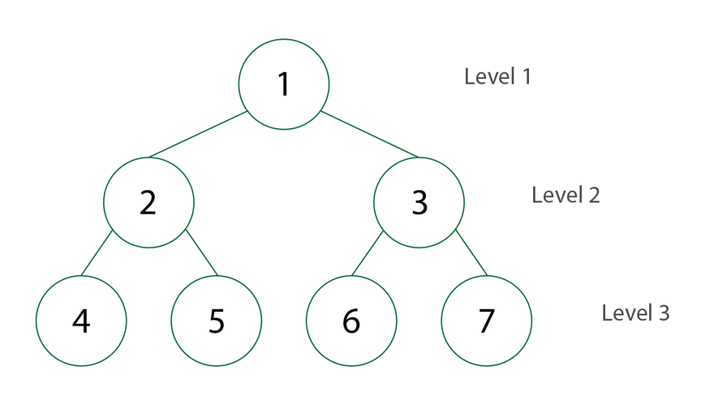
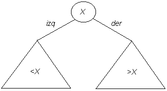

---

marp: true
theme: default
class: invert
paginate: true
author: Rodrigo Alvarez
lang: es-CL
transition: slide
footer: BST 
math: mathjax

---

<script type="module">
  import mermaid from 'https://cdn.jsdelivr.net/npm/mermaid@10/dist/mermaid.esm.min.mjs';
  mermaid.initialize({ startOnLoad: true, theme: 'dark' });
</script> 

# Estructura de datos y algoritmos

Rodrigo Alvarez
rodrigo.alvarez2@mail.udp.cl

---

# Árboles

- Son una estructura de datos no lineal, llamadas estructuras jerárquicas
- Son las estructuras no lineales más utilizadas para resolver problemas de software como:
  - Árboles de directorios
  - Toma de decisiones
  - Organización de información en bases de datos
  - etc



---

## Árboles: definiciones

- Un Árbol consiste en un nodo <span style="color:red;"> **r** </span> denominado nodo raíz y una lista o conjunto de subárboles ($A_1$, $A_2$, $A_3$, … $A_n$)
- Se definen como nodos hijos de <span style="color:red;"> **r** </span> a los nodos raíces de los subárboles $A_1$, $A_2$, $A_3$, … $A_n$
- Si <span style="color:blue;"> **b** </span> es un nodo hijo de <span style="color:green;"> **a** </span> entonces <span style="color:green;"> **a** </span> es el nodo padre de <span style="color:blue;"> **b** </span>
- Un nodo puede tener cero o más hijos, y uno o ningún padre. El único nodo que no tiene padre es el nodo raíz del árbol

---

## Árboles: definiciones

- **Subárbol**: Un árbol que es parte de otro árbol
- **Profundidad de un nodo**: Número de aristas que hay desde la raíz hasta el nodo
- **Altura de un nodo**: Número de aristas que hay desde el nodo hasta el nodo más lejano

---

## Árbol binario



- Es un árbol en el que cada nodo tiene a lo más dos hijos
- Cada nodo tiene un nodo padre, excepto la raíz


---

## Nodo

```java
class Node {
  int data;
  Node left, right;
  Node(int item) {
    data = item;
    left = right = null;
  }
}

```

---

## Recorridos (tree traversals)

---

## Recorrido Inorder

En este recorrido, de manera **recursiva**, primero se visita el **subárbol izquierdo**, luego la **raíz** y finalmente el **subárbol derecho**



---


## Recorrido Inorder

En este recorrido primero se visita el subárbol izquierdo, luego la raíz y finalmente el subárbol derecho


---

## Recorrido Inorder

```java
void inorder(Node node) {
  if (node == null) return;
  inorder(node.left);
  System.out.print(node.data + " ");
  inorder(node.right);
}
```

---

## Recorrido Preorder

En este recorrido primero se visita la raíz, luego el subárbol izquierdo y finalmente el subárbol derecho



---

## Recorrido Preorder

En este recorrido primero se visita la raíz, luego el subárbol izquierdo y finalmente el subárbol derecho


---

## Recorrido Preorder

```java
void preorder(Node node) {
  if (node == null) return;
  System.out.print(node.data + " ");
  preorder(node.left);
  preorder(node.right);
}
```

---

## Recorrido Postorder

En este recorrido primero se visita el subárbol izquierdo, luego el subárbol derecho y finalmente la raíz




---

## Recorrido Postorder

En este recorrido primero se visita el subárbol izquierdo, luego el subárbol derecho y finalmente la raíz


---

## Recorrido Postorder

```java
void postorder(Node node) {
  if (node == null) return;
  postorder(node.left);
  postorder(node.right);
  System.out.print(node.data + " ");
}
```

---

## Recorrido por niveles

En este recorrido se recorre el árbol por niveles



---

## Recorrido por niveles

En este recorrido se recorre el árbol por niveles


---

## Recorrido por niveles

```java
void byLevelTraversal(Node root) {
  if (root == null) return;
  Queue<Node> q = new LinkedList<>();
  q.add(root);
  while (!q.isEmpty()) {
    Node node = q.poll();
    System.out.print(node.data + " ");
    if (node.left != null) q.add(node.left);
    if (node.right != null) q.add(node.right);
  }
}
```

---

## Árbol binario de búsqueda (BST)

Sea $A$ un árbol binario de raíz $R$ e hijos izquierdo y derecho (posiblemente nulos) $H_I$ y $H_D$, respectivamente.

Decimos que $A$ es un árbol binario de búsqueda (BST en inglés) si y solo si se satisfacen las dos condiciones al mismo tiempo:

- $H_I$ es un BST con todos los elementos menores que $R$ $\lor$ $H_I$ es un árbol vacío
- $H_D$ es un BST con todos los elementos mayores que $R$ $\lor$ $H_D$ es un árbol vacío



---


---

## Árbol binario de búsqueda (BST): operaciones

- **Búsqueda**: Buscar un elemento en el árbol
- **Inserción**: Insertar un elemento en el árbol
- **Eliminación**: Eliminar un elemento del árbol

---

- [implementación de un BST](https://youtu.be/zIX3zQP0khM?si=hfvqn09o68lCse78)
- MIT Binary trees
  - [parte 1](https://youtu.be/76dhtgZt38A?si=xDKz6qA-uLyonGDC)
  - [parte 2](https://youtu.be/U1JYwHcFfso?si=sM75tsfVAcR4ZLV-)
- [árboles binarios](https://youtu.be/OVCNzj5BMcs?si=HJZ63gQoOATE7oJj)
- [árboles binarios de busqueda (bst)](https://youtu.be/G1VS5FbtMS4?si=VY_rj65jjMfdqjs4)