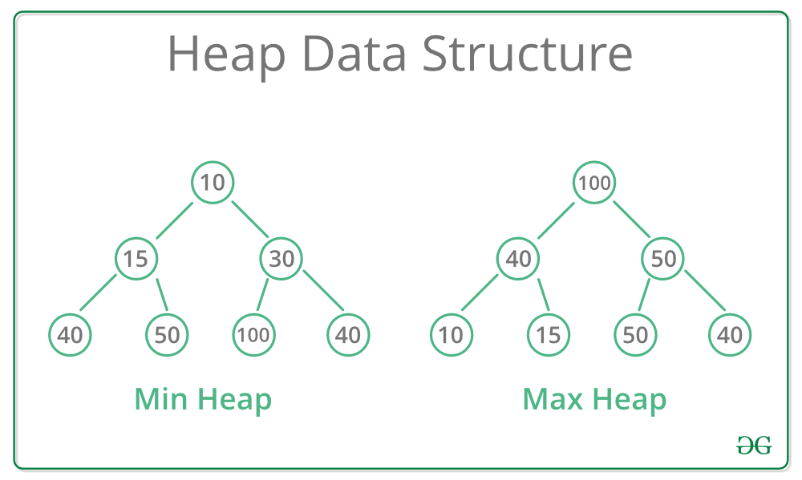

---

marp: true
theme: default
class: invert
paginate: true
author: Rodrigo Alvarez
lang: es-CL
transition: slide
footer: Repaso solemne/control 4
math: mathjax

---

# Estructura de datos y algoritmos

Rodrigo Alvarez
rodrigo.alvarez2@mail.udp.cl

---

# Árboles

---

## Árboles

- Son una estructura de datos jerárquica
- Muy utilizadas para resolver problemas de software como:
  - Árboles de directorios
  - Toma de decisiones
  - Organización de información en bases de datos
  - etc


---

## Árboles: definiciones

- **Subárbol**: Un árbol que es parte de otro árbol
- **Profundidad de un nodo**: Número de aristas que hay desde la raíz hasta el nodo
- **Altura de un nodo**: Número de aristas que hay desde el nodo hasta el nodo más lejano

---

## Árbol binario


- Es un árbol en el que cada nodo tiene a lo más dos hijos
- Cada nodo tiene un nodo padre, excepto la raíz


---

## Nodo

```java
class Node {
  int data;
  Node left, right;
  Node(int item) {
    data = item;
    left = right = null;
  }
}

```

---


## Recorridos (tree traversals)

- Los recorridos son una forma de visitar los nodos de un árbol

---


## Recorrido Inorder

En este recorrido primero se visita el subárbol izquierdo, luego la raíz y finalmente el subárbol derecho


---

## Recorrido Inorder

```java
void inorder(Node node) {
  if (node == null) return;
  inorder(node.left);
  System.out.print(node.data + " ");
  inorder(node.right);
}
```

---

## Recorrido Preorder

En este recorrido primero se visita la raíz, luego el subárbol izquierdo y finalmente el subárbol derecho


---

## Recorrido Preorder

```java
void preorder(Node node) {
  if (node == null) return;
  System.out.print(node.data + " ");
  preorder(node.left);
  preorder(node.right);
}
```


---

## Recorrido Postorder

En este recorrido primero se visita el subárbol izquierdo, luego el subárbol derecho y finalmente la raíz


---

## Recorrido Postorder

```java
void postorder(Node node) {
  if (node == null) return;
  postorder(node.left);
  postorder(node.right);
  System.out.print(node.data + " ");
}
```

---

## Recorrido por niveles

En este recorrido se recorre el árbol por niveles


---

## Recorrido por niveles

```java
void byLevelTraversal(Node root) {
  if (root == null) return;
  Queue<Node> q = new LinkedList<>();
  q.add(root);
  while (!q.isEmpty()) {
    Node node = q.poll();
    System.out.print(node.data + " ");
    if (node.left != null) q.add(node.left);
    if (node.right != null) q.add(node.right);
  }
}
```

---

## Búsqueda en árboles

- Los recorridos son útiles para buscar elementos en un árbol
- El recorrido por niveles puede ser utilizado para buscar un elemento en un metodo de búsqueda en anchura (BFS)
- Los recorridos inorder, preorder y postorder pueden ser utilizados para buscar un elemento en un método de búsqueda en profundidad (DFS)

---

## Árbol binario de búsqueda (BST)

- Es un árbol binario en el que para cada nodo:
  - Todos los nodos del subárbol izquierdo son menores
  - Todos los nodos del subárbol derecho son mayores
  - Los subárboles izquierdo y derecho también son BST
- Permite realizar búsquedas eficientes


---


---

## Árbol binario de búsqueda (BST): operaciones

- **Búsqueda**: Buscar un elemento en el árbol
- **Inserción**: Insertar un elemento en el árbol
- **Eliminación**: Eliminar un elemento del árbol

---

## Árboles binarios de búsqueda: busqueda

- Se recorre el árbol desde la raiz
- Si el nodo actual no es el nodo buscado, se decide si hay que buscar por la derecha o por la izquierda
- El algoritmo para, cuando se encuentra el nodo con el valor buscado o al llegar a un árbol vacío


---

## Árboles binarios de búsqueda: busqueda

Recursivamente desde la raíz:

- Si el nodo que se busca es menor que el nodo actual, se busca en el subárbol izquierdo
- Si el nodo que se busca es mayor que el nodo actual, se busca en el subárbol derecho
- Si el nodo que se busca es igual al nodo actual, se ha encontrado el nodo
- Si el nodo que se busca no existe, se ha llegado a un nodo nulo

---


---


---


---

## Árboles binarios de búsqueda: búsqueda

- En el peor caso, en la búsqueda se realizan `h` comparaciones, donde `h` es la altura del árbol
- Por lo tanto, la complejidad será `O(h)` donde `h` es la altura del árbol


---

## Árboles binarios de búsqueda: búsqueda

```java
Node search(Node root, int value) {
  if (root == null || root.data == value) return root;
  if (root.data < value) return search(root.right, value);
  else return search(root.left, value);
}
```

---

## Búsqueda binaria a BST


- Existe una relación entre la búsqueda binaria y los árboles binarios de búsqueda
- La búsqueda en un BST sigue el mismo principio que la búsqueda binaria
- Un BST puede ser visto como una versión más flexible de la búsqueda binaria


---

## Árboles binarios de búsqueda: inserción

- Los nodos se insertan siempre como nodos hoja
- La inserción en un árbol binario de búsqueda es similar a la búsqueda
- La diferencia radica en que si se llega a un nodo nulo, se inserta el nodo en ese lugar


---

## Árboles binarios de búsqueda: inserción

Recursivamente desde la raíz:

- Si el nodo que se busca insertar es menor que el nodo actual, se busca en el subárbol izquierdo
- Si el nodo que se busca insertar es mayor que el nodo actual, se busca en el subárbol derecho
- Si el nodo que se busca insertar es igual al nodo actual, se ha encontrado el nodo y no se inserta (no se permiten duplicados)
- Si el nodo actual es nulo, se inserta el nodo en ese lugar

---

```java
Node insert(Node root, int value) {
  if (root == null) return new Node(value);
  if (root.data < value) root.right = insert(root.right, value);
  else if (root.data > value) root.left = insert(root.left, value);
  return root;
}
```

---

## Árboles binarios de búsqueda: eliminación

<small>

- La eliminación en un árbol binario de búsqueda es más compleja que la búsqueda e inserción
- Se deben considerar tres casos:
  - Si el nodo a eliminar es una hoja:
    - Se elimina el nodo
  - Si el nodo a eliminar tiene un solo hijo:
    - Se elimina el nodo y se reemplaza por su hijo
  - Si el nodo a eliminar tiene dos hijos:
    - Se reemplaza el nodo por el nodo más pequeño del subárbol derecho o el nodo más grande del subárbol izquierdo (sucesor o predecesor)
    - Se elimina el nodo

</small>

---

## Árboles binarios de búsqueda: eliminación

Caso 1: Nodo hoja


---

## Árboles binarios de búsqueda: eliminación

Caso 2: Nodo con un hijo


---

## Árboles binarios de búsqueda: eliminación

Caso 3: Nodo con dos hijos


---

## Árboles binarios de búsqueda: eliminación

```java
Node remove(Node root, int value) {
  if (root == null) return root;
  if (root.data < value) root.right = remove(root.right, value);
  else if (root.data > value) root.left = remove(root.left, value);
  else {
    if (root.left == null) return root.right;
    else if (root.right == null) return root.left;
    root.data = minValue(root.right);
    root.right = remove(root.right, root.data);
  }
  return root;
}
```

---

[https://visualgo.net/en/bst](https://visualgo.net/en/bst)

<iframe
 frameBorder="0"
 height="450px"  
 src="https://visualgo.net/en/bst" 
 width="100%"
 >
</iframe>

---

## Árboles binarios balanceados

- Un árbol binario de búsqueda puede degenerar en una lista enlazada si se insertan los elementos en orden
- Para evitar esto, se pueden utilizar árboles binarios balanceados
- Un árbol binario balanceado es un árbol binario de búsqueda en el que la altura de los subárboles izquierdo y derecho de cada nodo difiere en no más de 1
- Los árboles binarios balanceados permiten realizar operaciones en tiempo logarítmico
- Existen estructuras de datos que implementan árboles binarios autobalanceados, como los árboles AVL y los árboles red-black

---

## AVL

- Un árbol AVL es un tipo especial de árbol binario ideado por los matemáticos soviéticos Adelson-Velskii y Landis. 
- Fue el primer árbol de búsqueda binario auto-balanceable que se ideó.
- En un árbol AVL, la diferencia de alturas entre los subárboles izquierdo y derecho de cualquier nodo es de a lo más 1.

---

# Heap y Priority Queue

---

## Priority Queue

- Una cola de prioridad es un tipo de dato abstracto que permite almacenar elementos con una prioridad asociada.
- Tiene tres operaciones básicas:
  - **Insertar (add)**: Insertar un elemento con una prioridad asociada.
  - **Eliminar (poll)**: Eliminar y retornar el elemento con mayor prioridad.
  - **Mirar (peek)**: Mirar el elemento con mayor prioridad.


---

## Priority Queue

- Ejemplos de uso:

  - Algoritmos de planificación (Scheduling): se utiliza en sistemas operativos para manejar la prioridad de tareas en la planificación de CPU.
  - Algoritmos de búsqueda de caminos (Pathfinding): en el algoritmo de Dijkstra.
  - Algoritmos de compresión: algoritmo de Huffman para la compresión de datos.
  


---


<a href="https://onecompiler.com/embed/java/42epyjru6?theme=dark">
<iframe
 frameBorder="0"
 height="450px"  
 src="https://onecompiler.com/embed/java/42epyjru6?theme=dark" 
 width="100%"
 >
</iframe>
</a>

---

## Heap

- Un heap es un árbol binario completo que cumple con la propiedad de heap.
- Un heap puede ser de dos tipos:
  - **Min heap**: El valor de cada nodo es menor o igual que el valor de sus hijos.
  - **Max heap**: El valor de cada nodo es mayor o igual que el valor de sus hijos.
  - En ambos casos, el nodo raíz tiene el valor más pequeño o más grande, respectivamente.
  - Es decir la raíz de un heap es el elemento con mayor prioridad.

---

## Heap



---

## Heap

- Un heap a pesar de ser un árbol binario, se puede representar como un arreglo.
- La relación entre los índices de los nodos y sus padres e hijos es la siguiente:
  - El hijo izquierdo de un nodo en la posición $i$ está en la posición $2i + 1$.
  - El hijo derecho de un nodo en la posición $i$ está en la posición $2i + 2$.
  - El padre de un nodo en la posición $i$ está en la posición $\left\lfloor \frac{i-1}{2} \right\rfloor$.
- Esta representación permite realizar operaciones de inserción y eliminación en tiempo logarítmico.
- La altura de un heap es $O(\log n)$, donde $n$ es la cantidad de elementos.

---

## Heap

 - left: $2i + 1$
 - right: $2i + 2$
 - parent: $\left\lfloor \frac{i-1}{2} \right\rfloor$


---

```java
class MaxHeap {
  int[] heap;
  int size;
  MaxHeap(int capacity) {
    heap = new int[capacity];
    size = 0;
  }
}
```

---

## Heap: Reheapify
 - Para poder mantener las invariantes del Heap, cada vez que este es modificado por una inserción o eliminación, es necesario recuperar el orden del heap, tambien llamado “reheapify” 
 - Existen dos casos cuando es necesario esta operación:
   - Cuando se inserta un elemento en un heap y su valor es mayor que el de su padre: 
     - Se realiza un “bottom-up heapify” o "swim up".
   - Cuando se hace eliminamos el nodo raiz y se reemplaza por el último elemento del heap:
     - Se realiza un “top-down heapify” o "sink down".

---

## Heap: insertar


<small style="font-size:20px;">

- Para insertar un elemento en un heap, se agrega el elemento al final del arreglo y se realiza un reheapify hacia arriba.
- En un max heap, se compara el elemento con su padre y si es mayor, se intercambian.
- En un min heap, se compara el elemento con su padre y si es menor, se intercambian.
- Se repite el proceso hasta que el elemento llegue a la raíz o su padre sea mayor o menor, según sea el caso.
- La complejidad de esta operación es $O(\log n)$.

</small>


---

```java
  ...
  void swap(int i, int j) {
    int temp = heap[i];
    heap[i] = heap[j];
    heap[j] = temp;
  }
  void insert(int value) {
    heap[size] = value;
    swim(size);
    size++;
  }
  void swim(int index) {
    int parent = (index - 1) / 2;
    while (index > 0 && arr[index] > arr[parent]) {
      swap(index, parent);
      index = parent;
      parent = (index - 1) / 2;
    }
  }
```


---

## Heap: eliminar

<small style="font-size:20px;">

- Para eliminar un elemento en un heap, se elimina el nodo raíz y se reemplaza por el último elemento del arreglo y se realiza un reheapify hacia abajo.
- En un max heap, se compara el elemento con sus hijos y se intercambia con el mayor.
- En un min heap, se compara el elemento con sus hijos y se intercambia con el menor.
- Se repite el proceso hasta que el elemento llegue a una hoja o sus hijos sean menores o mayores, según sea el caso.
- La complejidad de esta operación es $O(\log n)$.

</small>


---

```java
  ...
  void remove() {
    heap[0] = heap[size-1];
    size--;
    sink(0);
  }
  void sink(int index) {
    while (2 * index + 1 < size) {
      int left = 2 * index + 1;
      int right = 2 * index + 2;
      int largest = left;
      if (right < size && arr[right] > arr[left]) {
        largest = right;
      }
      if (arr[index] >= arr[largest]) {
        break;
      }
      swap(index, largest);
      index = largest;
    }

  }
```

---

[https://visualgo.net/en/heap](https://visualgo.net/en/heap)

<iframe
 frameBorder="0"
 height="450px"  
 src="https://visualgo.net/en/heap" 
 width="100%"
 >
</iframe>

---

- [https://leetcode.com/problems/range-sum-of-bst/](https://leetcode.com/problems/range-sum-of-bst/)
- [https://leetcode.com/problems/minimum-number-game/](https://leetcode.com/problems/minimum-number-game/)