---

marp: true
theme: default
class: invert
paginate: true
author: Rodrigo Alvarez
lang: es-CL
transition: slide
footer: Repaso solemne/control 4
math: mathjax

---

# Estructura de datos y algoritmos

Rodrigo Alvarez
rodrigo.alvarez2@mail.udp.cl

---


## Grafos: spanning tree (árbol de recubrimiento)

<small>

- Dado un grafo `G`, un <u>**árbol de recubrimiento**</u> (ST) es un subgrafo conexo acíclico (es decir, un árbol) que contiene todos los vértices de `G`.
- Si el grafo es ponderado, cada arista tiene un peso asociado o coste.
  - En tal caso, el coste total del árbol de recubrimiento es la suma de los pesos de todas las aristas del árbol.
  - El <u>**árbol de recubrimiento mínimo**</u> (MST) es el árbol de recubrimiento cuyo coste total es mínimo.

</small>

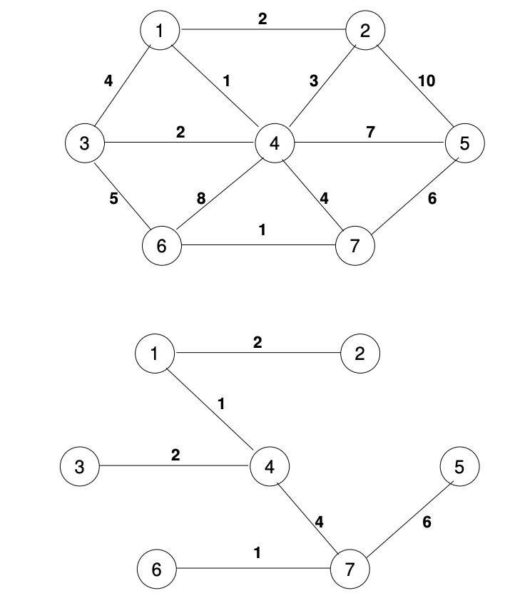

---

## Grafos: spanning tree

<small>
 
 - Problema: minimizar el cableado que se necesita para conectar la red telefónica de una ciudad.

</small>

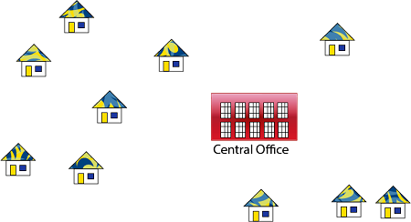

---

## Grafos: spanning tree

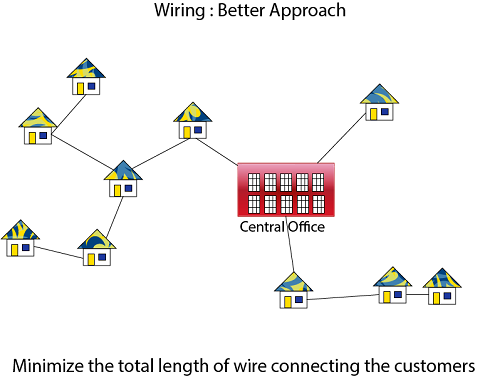

---

## MST: Algoritmo de Prim

- El algoritmo de Prim es un algoritmo **greedy** que encuentra un árbol de recubrimiento mínimo para un grafo ponderado conexo.
- El algoritmo mantiene un conjunto de nodos que ya han sido incluidos en el árbol de recubrimiento mínimo.
- En cada paso, el algoritmo busca el nodo más cercano (cuya arista tenga menor peso) al conjunto de nodos incluidos y lo agrega al árbol.
- El algoritmo termina cuando todos los nodos han sido incluidos en el árbol.

---

## MST: Algoritmo de Prim


---

## MST: Algoritmo de Prim

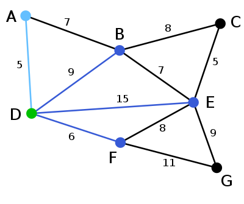

---


## MST: Algoritmo de Prim

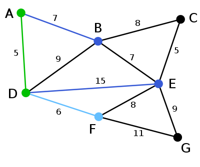


---

## MST: Algoritmo de Prim

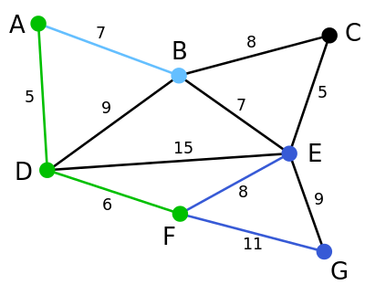


---

## MST: Algoritmo de Prim

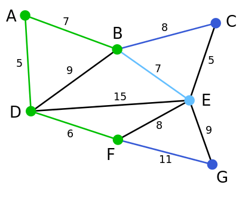


---

## MST: Algoritmo de Prim

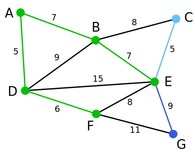


---

## MST: Algoritmo de Prim

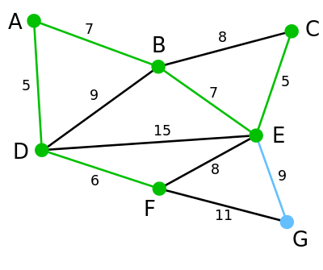


---


## MST: Algoritmo de Prim


```java

public class Edge {
  public int weight;
  public boolean included;
}

public class Neighbor {
  public Node node;
  public Edge edge;
  public boolean isVisited() {
    return edge.included || node.visited;
  }
}

```

---

## MST: Algoritmo de Prim

```java

public class Node {
  public int data;
  public boolean visited;
  public LinedList<Neighbor> neighbors = new LinkedList<>();
  
  public void addNeighbor(Node v, Edge edge) {
    neighbors.add(new Neighbor<>(v, edge));
  }
}


```

---

## MST: Algoritmo de Prim

```java

public class Prim {

  public Node[] run(Node[] graph) {
    if (graph == null || graph.length == 0) {
      return null;
    }
    graph[0].visited = true;

    boolean allVisited = false;

    while (!allVisited) {
      allVisited = true;
      for (Node node : graph) {
        if (node.visited) {
          Neighbor minNeighbor = null;
          for (Neighbor neighbor : node.neighbors) {
            if (!neighbor.isVisited()) {
              if (minNeighbor == null || neighbor.edge.weight < minNeighbor.edge.weight) {
                minNeighbor = neighbor;
              }
              allVisited = false;
            }
          }
          if (minNeighbor != null) {
            minNeighbor.node.visited = true;
            minNeighbor.edge.included = true;
          }
        }
      }
    }

    return graph;
  }
}

```


---

## MST: Algoritmo de Kruskal

- El algoritmo de Kruskal es un algoritmo **greedy** que encuentra un árbol de recubrimiento mínimo para un grafo ponderado conexo.
- El algoritmo mantiene un conjunto de aristas ordenadas por peso.
- En cada paso, el algoritmo selecciona la arista de menor peso que no forma un ciclo con las aristas seleccionadas previamente.
- El algoritmo termina cuando todas las aristas han sido incluidas en el árbol.

---

## MST: Algoritmo de Kruskal


---

## MST: Algoritmo de Kruskal

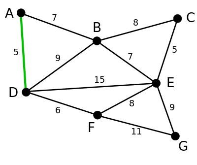

---

## MST: Algoritmo de Kruskal

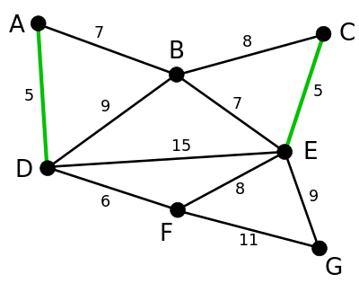

---

## MST: Algoritmo de Kruskal

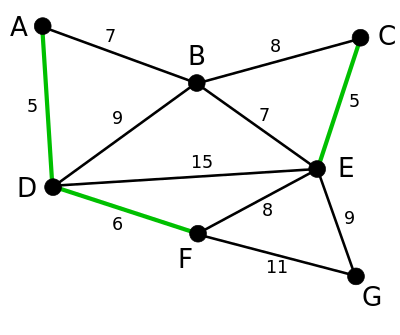

---

## MST: Algoritmo de Kruskal

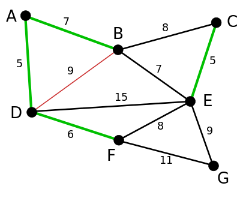


---

## MST: Algoritmo de Kruskal

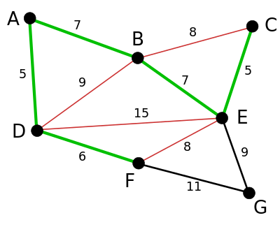

---

## MST: Algoritmo de Kruskal

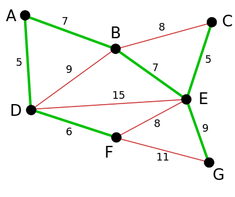


---

## Grafos: Shortest Path

- Dado un grafo `G`, un <u>**camino más corto**</u> (SP) es una secuencia de aristas que conectan dos vértices de `G` de tal forma que la suma de los pesos de las aristas es mínima.
- El problema de encontrar el camino más corto entre dos vértices de un grafo es un problema clásico en teoría de grafos.
- Existen varios algoritmos para resolver este problema, entre los cuales destacan el algoritmo de Dijkstra y el algoritmo de Bellman-Ford.

---

## Grafos: Shortest Path

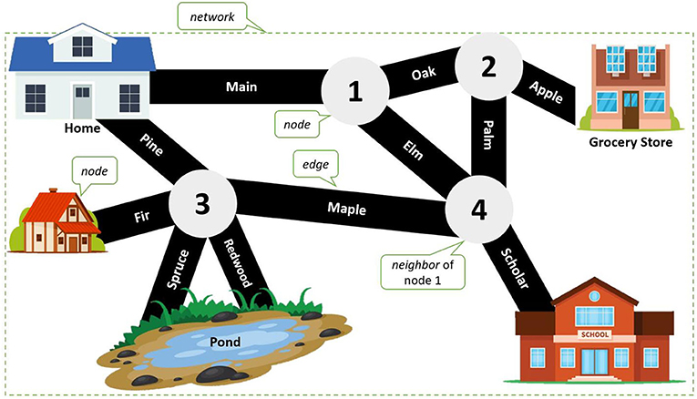

---

## SP: Dijkstra

- El algoritmo de Dijkstra es un algoritmo **greedy** que encuentra el camino más corto entre un vértice origen y todos los demás vértices de un grafo ponderado conexo.
- El algoritmo mantiene un conjunto de nodos cuyas distancias al vértice origen ya han sido calculadas.
- En cada paso, el algoritmo selecciona el nodo más cercano al vértice origen que no ha sido incluido en el conjunto y actualiza las distancias de sus vecinos.
- El algoritmo termina cuando todos los nodos han sido incluidos en el conjunto.
- El algoritmo de Dijkstra **no funciona** con aristas de peso negativo.


---

## SP: Dijkstra - Ejemplo:

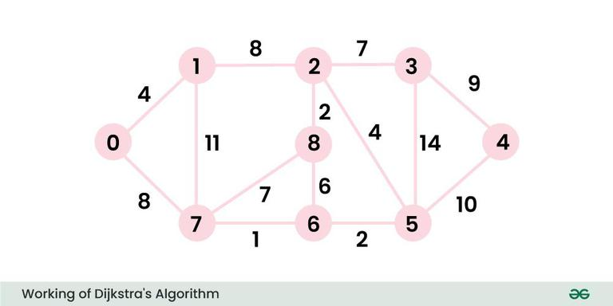

---


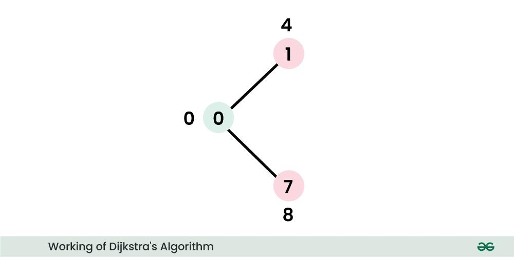

---


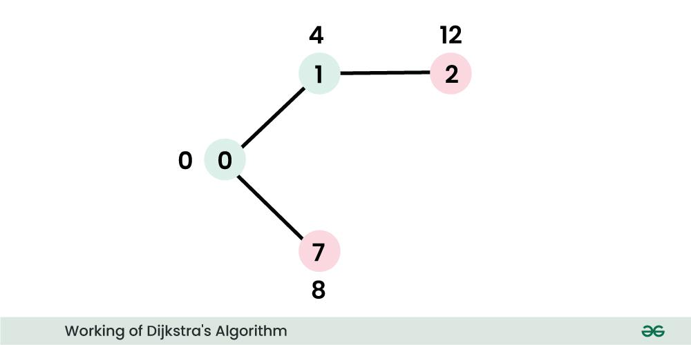

---


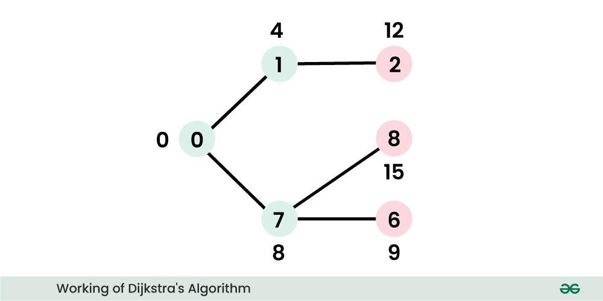

---


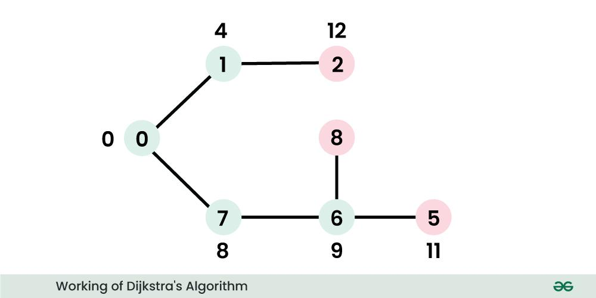

---


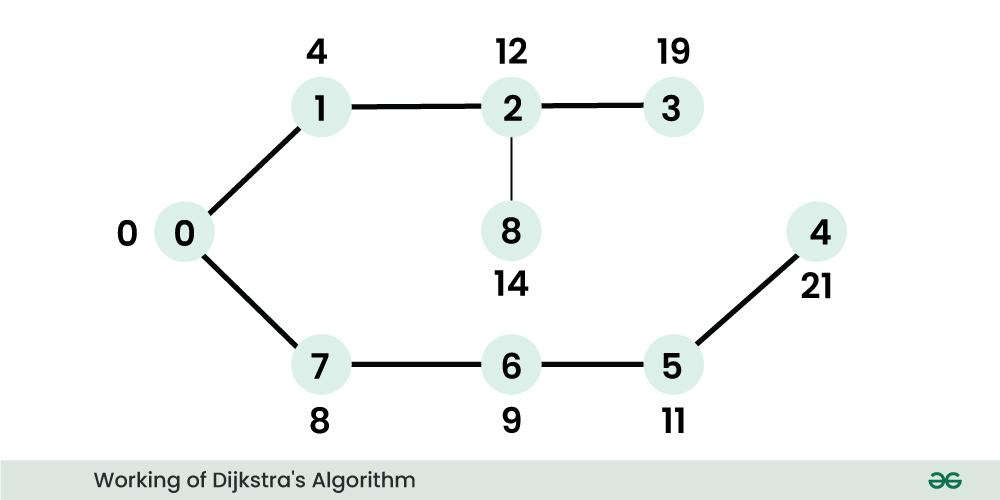

---

- [Kruskal en java](https://youtu.be/JptKmWQSerU?si=no-3ICozb8z6pTXB)
- [Dijkstra en java](https://youtu.be/BuvKtCh0SKk?si=6ikxSJgAbUflVAA7)