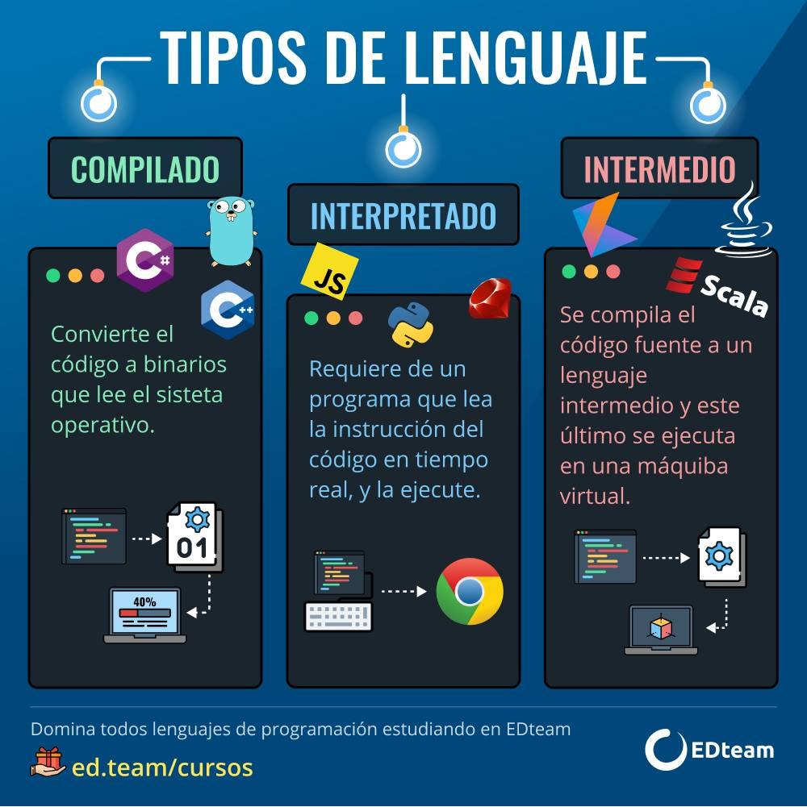

---

marp: true
theme: default
class: invert
paginate: true
author: Rodrigo Alvarez
lang: es-CL
transition: slide
footer: Intro a Java 

---

# Estructura de datos y algoritmos

Rodrigo Alvarez
rodrigo.alvarez2@mail.udp.cl

---

## Que es java?

---

## Que es java?


---

## Que es java?
  - Desarrollado por Sun Microsystems
  - Lanzado en 1995
  - Actualmente propiedad de Oracle
  - Open Source


---

## Que es java?

  - Lenguaje compilado a bytecode (corre encima de la jvm)
  - Fuertemente orientado a objetos
  - Sintaxis similar a C++
  - Multiplataforma



---


---

## [Hello world](https://onecompiler.com/embed/java?theme=dark)
<a href="https://onecompiler.com/embed/java?theme=dark">
<iframe
 frameBorder="0"
 height="450px"  
 src="https://onecompiler.com/embed/java?theme=dark" 
 width="100%"
 >
 </iframe>
 </a>

---

| Tipo dato | Tamaño    | Descripción |
| --------- | ------- | ------- |
| byte      | 1 byte  | números del -128 al 127 |
| short     | 2 bytes | -32,768 al 32,767 | 
| int       | 4 bytes | -2,147,483,648 al 2,147,483,647 |
| long      | 8 bytes | -9,223,372,036,854,775,808 al 9,223,372,036,854,775,807|
| float     | 4 bytes | números racionales, hasta 7 digitos decimales |
| double    | 8 bytes | hasta 15 digitos decimales |
| boolean   | 1 bit   | true o false |
| char      | 2 bytes | un único carácter |

---

## Operadores aritméticos

| Operator | Name           | Description                            | Example |  
| -------- | -------------- | -------------------------------------- | ------- |
| +        | Addition       | Adds together two values               | `x + y`   |
| \-       | Subtraction    | Subtracts one value from another       | `x - y`   |
| \*       | Multiplication | Multiplies two values                  | `x * y`  | 
| /        | Division       | Divides one value by another           | `x / y`   | 
| %        | Modulus        | Returns the division remainder         | `x % y`   |
| ++       | Increment      | Increases the value of a variable by 1 | `++x`     |
| \--      | Decrement      | Decreases the value of a variable by 1 | `--x`    |


---

## Operadores de asignación

| Operator | Example | Same As    |
| -------- | ------- | ---------- |
| `=`       | `x = 5`   | `x = 5`     |
| `+=`       | `x += 3`  | `x = x + 3`  |
| `-=`      | `x -= 3`  | `x = x - 3`  |
| `*=`      | `x *= 3` | `x = x * 3` |
| `/=`       | `x /= 3`  | `x = x / 3`  |
| `%=`       | `x %= 3`  | `x = x % 3`  |

---
## Operadores de comparación

| Operator   | Name                     | Example |
| --------   | ------------------------ | ------- |
| `==`       | Equal to                 | `x == y`  |
| `!=`       | Not equal                | `x != y`  |
| `>`       | Greater than             | `x > y`   |
| `<`        | Less than                | `x < y`   |
| `>=`      | Greater than or equal to | `x >= y`  |
| `<=`       | Less than or equal to    | `x <= y`  |

---

## Operadores lógicos

| Operator | Name        | Description                                             | Example            |
| -------- | ----------- | ------------------------------------------------------- | ------------------ |
| `&&`       | Logical and | true if both statements are true                | `x < 5 && x < 10`    |
| `\|\|`       | Logical or  | true if one of the statements is true           | `x < 5 \|\| x < 4`     |
| `!`        | Logical not | Reverse the result | `!(x < 5 && x < 10)` |

---

## [I/O: Input/Output en java](https://onecompiler.com/embed/java/427p45t7h)

<a href="https://onecompiler.com/embed/java/427p45t7h?theme=dark">
<iframe
 frameBorder="0"
 height="450px"  
 src="https://onecompiler.com/embed/java/427p45t7h?theme=dark" 
 width="100%"
 >
 </iframe>
 </a>

---

## Scanner class
La clase `Scanner` se utiliza para obtener la entrada del usuario, y es parte del paquete `java.util`.

<small style="margin-top: 10px;">

| Method          | Description                           |
| --------------- | ------------------------------------- |
| `nextBoolean()` | Reads a `boolean` value from the user |
| `nextByte()`    | Reads a `byte` value from the user    |
| `nextDouble()`  | Reads a `double` value from the user  |
| `nextFloat()`   | Reads a `float` value from the user   |
| `nextInt()`     | Reads a `int` value from the user     |
| `nextLine()`    | Reads a `String` value from the user  |
| `nextLong()`    | Reads a `long` value from the user    |

</small>

---
## [Scanner](https://onecompiler.com/embed/java/427nv54rs)

<a href="https://onecompiler.com/embed/java/427nv54rs?theme=dark">
<iframe
 frameBorder="0"
 height="450px"  
 src="https://onecompiler.com/embed/java/427nv54rs?theme=dark" 
 width="100%"
 >
 </iframe>
 </a>

---

## [if, else, while, for](https://onecompiler.com/embed/java/427nvkqmd)

<a href="https://onecompiler.com/embed/java/427nvkqmd?theme=dark">
  <iframe
    frameBorder="0"
    height="450px"  
    src="https://onecompiler.com/embed/java/427nvkqmd?theme=dark" 
    width="100%"
  >
 </iframe>
</a>

---

## [Strings](https://onecompiler.com/embed/java/427nu2xbm)

<a href="https://onecompiler.com/embed/java/427nu2xbm?theme=dark">
  <iframe
  frameBorder="0"
  height="450px"  
  src="https://onecompiler.com/embed/java/427nu2xbm?theme=dark" 
  width="100%"
  >
  </iframe>
</a>

[String methods](https://www.w3schools.com/java/java_ref_string.asp)

---

## [Arrays](https://onecompiler.com/embed/java/427p4c9xn)
<a href="https://onecompiler.com/embed/java/427p4c9xn?theme=dark">
  <iframe
  frameBorder="0"
  height="450px"  
  src="https://onecompiler.com/embed/java/427p4c9xn?theme=dark" 
  width="100%"
  >
  </iframe>
</a>

---

## [Métodos](https://www.w3schools.com/java/java_methods.asp)

```
[modificador de acceso] [tipo_retorno] nombre_funcion(tipo_1 parametro_1, tipo_2 parametro_2, ...){
	// instrucciones
	return valor;
}
```

---

## [Métodos](https://onecompiler.com/embed/java/427p5fbvj)
<a href="https://onecompiler.com/embed/java/427p5fbvj?theme=dark">
  <iframe
  frameBorder="0"
  height="450px"  
  src="https://onecompiler.com/embed/java/427p5fbvj?theme=dark" 
  width="100%"
  >
  </iframe>
</a>

---

## [Clases](https://onecompiler.com/embed/java/427pmavjh)
<a href="https://onecompiler.com/embed/java/427pmavjh?theme=dark">
  <iframe
  frameBorder="0"
  height="450px"  
  src="https://onecompiler.com/embed/java/427pmavjh?theme=dark" 
  width="100%"
  >
  </iframe>
</a>

---

## [Herencia](https://onecompiler.com/embed/java/427pqrv5m)

<a href="https://onecompiler.com/embed/java/427pqrv5m?theme=dark">
  <iframe
  frameBorder="0"
  height="450px"  
  src="https://onecompiler.com/embed/java/427pqrv5m?theme=dark" 
  width="100%"
  >
  </iframe>
</a>

---

## [Interfaces](https://www.w3schools.com/java/java_interface.asp)
Las interfaces en Java son una colección de métodos abstractos y constantes que pueden ser implementados por cualquier clase que las implemente. 
Una interfaz define un conjunto de métodos y su firma, pero no proporciona implementaciones de los métodos.


---

## [Interfaces](https://onecompiler.com/embed/java/427pruj44)

<a href="https://onecompiler.com/embed/java/427pruj44?theme=dark">
  <iframe
  frameBorder="0"
  height="450px"  
  src="https://onecompiler.com/embed/java/427pruj44?theme=dark" 
  width="100%"
  >
  </iframe>
</a>

---

## [Generics](https://onecompiler.com/embed/java/427psdcfw)

<a href="https://onecompiler.com/embed/java/427psdcfw?theme=dark">
  <iframe
  frameBorder="0"
  height="450px"  
  src="https://onecompiler.com/embed/java/427psdcfw?theme=dark" 
  width="100%"
  >
  </iframe>
</a>

---

- [Reto](https://onecompiler.com/challenges/427ngt86f/intro-a-java)
- [Por que hay tantos JDKs?](https://youtu.be/aYWZvbUWwjo?si=u7In463_zpo1HPLD)