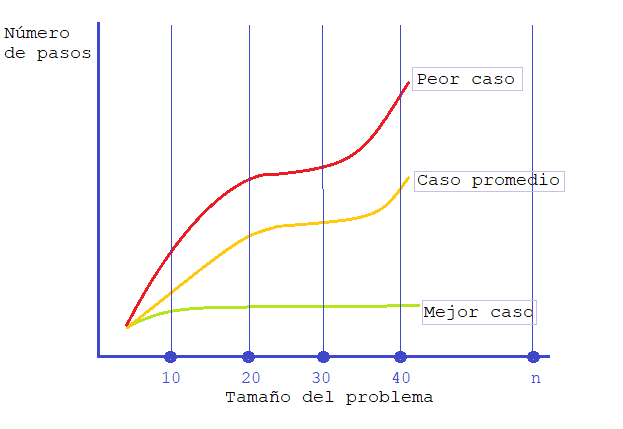
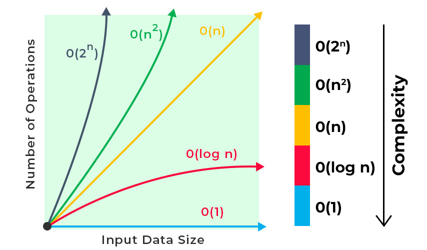
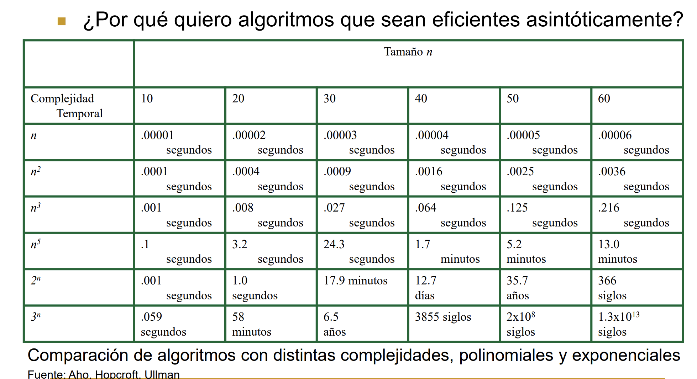
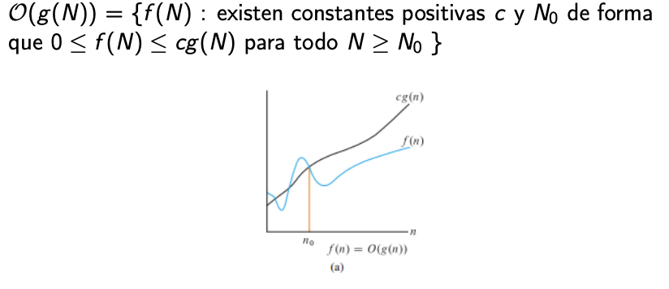
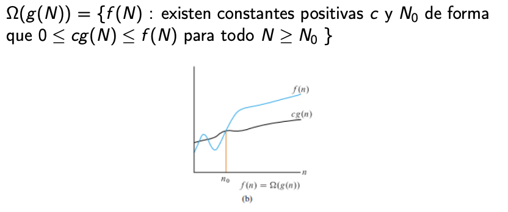
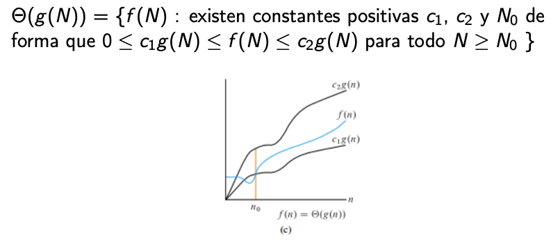

---

marp: true
theme: default
class: invert
paginate: true
author: Rodrigo Alvarez
lang: es-CL
transition: slide
footer: Complejidad algorítmica

---

## Problema computacional

Un problema computacional se puede describir como un enunciado que describe la relación entre un conjunto de datos de entrada y otro de salida.

---

## Algoritmo
Un algoritmo es un conjunto de instrucciones finitas y bien definidas que transforman cada instancia de entrada de un problema en un valor de salida especifico.

---

## Análisis de algoritmos

 - Funcionamiento correcto
 - Eficiencia en el tiempo de ejecución
 - Eficiencia en el espacio

---

## Métricas de comparación de algoritmos

  - Tiempo de ejecución
  - Espacio en memoria
  - Uso de procesadores
  - Uso de dispositivos de entrada/salida

Es importante tener en cuenta que la **elección de un algoritmo** o una implementación **depende** en gran medida del **contexto** y el **hardware** a utilizar.

<!-- En este curso, nos enfocamos principalmente en el análisis de la complejidad temporal como métrica principal para comparar algoritmos.
-->

---

## Análisis de complejidad temporal

El análisis de complejidad temporal es una técnica que permite determinar cuánto tiempo tardará un algoritmo en ejecutarse en función del tamaño de los datos de entrada.

### Empírica o experimental
Consiste en medir el tiempo de ejecución en una computadora específica para una entrada dada.

---

### Ejemplo de análisis empírico

<a href="https://onecompiler.com/embed/java/427w6q834?theme=dark">
  <iframe
    frameBorder="0"
    height="450px"  
    src="https://onecompiler.com/embed/java/427w6q834?theme=dark" 
    width="100%"
  >
 </iframe>
</a>

<!-- 
Existen varios problemas en hacer un análisis empírico o experimental del tiempo de ejecución de los algoritmos:
 - La variabilidad: Las mediciones pueden variar significativamente según el hardware utilizado y las condiciones en que se ejecuta el algoritmo. Por lo tanto, es difícil hacer comparaciones significativas entre diferentes algoritmos.
 - Las limitaciones de hardware: El hardware utilizado puede limitar el rendimiento del algoritmo y hacer que el análisis sea impreciso. Además, los recursos de hardware, como la memoria y el procesador, pueden ser compartidos con otros procesos, lo que puede afectar la medición del tiempo de ejecución.
 - La selección de entradas: La elección de entradas para el análisis puede influir en el resultado. Si se seleccionan entradas atípicas o muy específicas, el rendimiento del algoritmo puede ser diferente en comparación con otras entradas.
 - La complejidad de la implementación: La complejidad de la implementación del algoritmo puede afectar el rendimiento. Por ejemplo, una implementación ineficiente puede hacer que el tiempo de ejecución sea mayor de lo que debería ser.
 - El costo y la dificultad de la medición: Medir el tiempo de ejecución puede ser costoso y difícil. Por ejemplo, puede ser necesario medir el tiempo de ejecución varias veces para obtener un resultado preciso, lo que puede llevar tiempo y recursos adicionales.
-->

---

## Análisis teórico

El análisis de complejidad es una herramienta fundamental para el diseño y optimización de algoritmos. Este análisis es basado en un "modelo de máquina" o "modelo de cómputo consensuado" se presenta como una medida "universal" válida para distintas implementaciones del algoritmo.
  - La **medida del tiempo** se refiere al número de instrucciones u operaciones elementales (OE) que se ejecutan en la máquina "ideal" para determinado input en función del tamaño del mismo.
  - La **medida espacial** se refiere a la cantidad de memoria necesaria para resolver un problema en la máquina ideal.

---

## Análisis de los distintos casos

Diferentes entradas de la misma longitud pueden causar que el algoritmo se comporte distinto, por lo que se podría analizar el algoritmo desde tres perspectivas: **el mejor caso**, **el caso promedio** y **el peor caso**.

---

## Operaciones elementales

Las operaciones elementales son aquellas operaciones básicas que el procesador puede realizar en un tiempo acotado por una constante, es decir, que no dependen del tamaño de la entrada. Estas operaciones incluyen las operaciones aritméticas básicas como la suma, resta, multiplicación y división, las comparaciones lógicas como mayor que, menor que, igual a, y las asignaciones a variables de tipos básicos como enteros, flotantes o caracteres.

Es importante tener en cuenta que el conjunto de operaciones elementales puede variar según el modelo de cómputo que se utilice.

---

## Análisis asintótico

El análisis asintótico es una técnica de análisis que permite describir la complejidad espacial o temporal de un algoritmo mediante el orden de crecimiento.

El orden de crecimiento se caracteriza mediante una función matemática, esta es la que describe la relación entre tiempo y tamaño de la entrada, o uso de memoria y tamaño de la entrada.

---

---

## Big O

---

## Big O

- Caracteriza la cota superior de una función, es decir que la función en cuestión no crece más rápido que un cierto ratio.
- Esta notación se usa para caracterizar el peor caso de tiempo de ejecución o memoria para un algoritmo.
- Digamos que un determinado algoritmo tiene tiempo de
ejecución en función de $T(N) = 7N^3 + 5N^2 − 20N + 7$. Esto en términos de Big O podría traducirse como $T(N) = O(N^3)$.
- La razón es que $7N^3 + 5N^2 − 20N + 7 ≤ cN^3$ con $c$ como una constante positiva.

---
## Big Omega

---

## Big Omega (Ω)
- La notación Notación Ω, conocida como Omega caracteriza la cota inferior de una función.
- Para el caso del ejemplo $T(N) = 7N^3 + 5N^2 − 20N + 7$, podemos decir que en términos de notación Omega el tiempo de ejecución es en magnitud de $Ω(N^3)$, $Ω(N^2)$ o incluso $Ω(1)$, siempre y cuando exista un $N$ para ese caso.

---

## Big Theta

---

## Big Theta (Θ)
- La notación Notación $Θ$, conocida como Theta caracteriza la cota ajustada de una función.
- Para el caso del ejemplo $T(N) = 7N^3 + 5N^2 − 20N +7$, si $T(N) = Ω(N^3)$ y $T(N) = O(N^3)$, entonces se puede decir $T(N) = Θ(N^3)$.

---

[Como analizar algoritmos](https://youtu.be/IZgOEC0NIbw?si=R1gBjmLBqOMgigt4)

[Guidelines for Asymptotic Analysis](https://youtu.be/BpiMRyWoDu0?si=FeWgFFnc4sQFkhij)

[Máquina de turing](https://youtu.be/S1PVPluvV9I?si=gzClhcJHhSf5KQym)