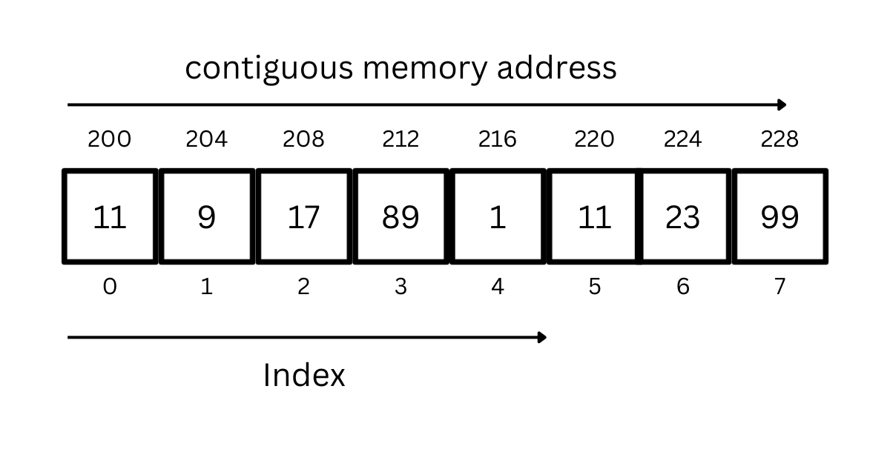

---

marp: true
theme: default
class: invert
paginate: true
author: Rodrigo Alvarez
lang: es-CL
transition: slide
footer: Listas
math: mathjax

---

# Estructura de datos y algoritmos

Rodrigo Alvarez
rodrigo.alvarez2@mail.udp.cl


---

## Encuesta

[https://forms.gle/F2aQanBkYFi4cfRP7](https://forms.gle/F2aQanBkYFi4cfRP7)
**<u>CÓDIGO:</u>** 200603

---

## TDA vs Estructuras de datos

- **Tipo de dato abstracto** (TDA)
  - Dice qué hace, no cómo lo hace. (especificación)
  - Que data se puede guardar 
  - Qué operaciones se pueden hacer / Qué es lo que significan.
- **Estructura de datos**
  - Dice cómo se hace. (implementación)
  - Cómo se guardan los datos 
  - **Cómo se hacen** las operaciones (algoritmos).
  

---

## Arrays
- Colección de elementos ordenados.
  - Cada elemento es una unidad básica de información.
  - Posición: Lugar que ocupa un elemento en el array.
- Tamaño fijo.



---

## Listas

- Colección de elementos ordenados.
  - Cada elemento es una unidad básica de información.
  - Posición: Lugar que ocupa un elemento en la lista.
- Tamaño es dinámico.

```java
interface List {
    int get_at(int i); // obtener elemento en posición i
    void insert_at(int i, int e); // agregar elemento en posición i
    int delete_at(int i); // remover elemento en posición i
    ...
    void insert_at_end(int e); // agregar elemento al final
    void insert_at_start(int e); // agregar elemento al inicio
    int delete_at_end(); // remover elemento al final
    int delete_at_start(); // remover elemento al inicio
}
```

---

## Listas
Usando generics:

```java
interface List<T> {
    T get_at(int i); // obtener elemento en posición i
    void insert_at(int i, T e); // agregar elemento en posición i
    T delete_at(int i); // remover elemento en posición i
    ...
    void insert_at_end(T e); // agregar elemento al final
    void insert_at_start(T e); // agregar elemento al inicio
    T delete_at_end(); // remover elemento al final
    T delete_at_start(); // remover elemento al inicio
}
```

---

## Nodo

- <small>Estructura básica utilizada en la construcción de la mayoría de las estructuras de datos</small>
- <small>Está compuesto por los datos que almacena y una lista de referencias a otros nodos</small>
   - <small>En el caso de las listas (básicas), pilas y colas solo contiene una referencia</small>
   - <small>En el caso de los árboles contiene dos o más referencias</small>

<small>

```java
class Node {
  int data;
  Node next;
  public Node(int data) {
    this.data = data;
    this.next = null;
  }
  public int getData() { return data; }
  public void setData(int data) { this.data = data; }
  public Node getNext() { return next; }
  public void setNext(Node next) { this.next = next; }
}
```

</small>

---

## Lista enlazada

- <small>Lista de nodos enlazados</small>
- <small>El último nodo apunta a `null`</small>
- <small>El primer nodo se llama `head`</small>


---
## Lista enlazada


---

## Lista enlazada

```java
class LinkedList {
  Node head;
  public LinkedList() {
    this.head = null;
  }
  public int get_at(int i) {
    Node current = head;
    for (int j = 0; j < i; j++) {
      current = current.next;
    }
    return current.data;
  }
  ...
}
```

---

```java
class LinkedList {
  ...
    public void insert_at(int i, int e) {
    Node newNode = new Node(e);
    if (i == 0) {
      newNode.next = head;
      head = newNode;
    } else {
      Node current = head;
      for (int j = 0; j < i - 1; j++) {
        current = current.next;
      }
      newNode.next = current.next;
      current.next = newNode;
    }
  }
  ...
}

```


---

## Lista enlazada

```java
class LinkedList {
  ...
  public int delete_at(int i) {
    if (i == 0) {
      int data = head.data;
      head = head.next;
      return data;
    } else {
      Node current = head;
      for (int j = 0; j < i - 1; j++) {
        current = current.next;
      }
      int data = current.next.data;
      current.next = current.next.next;
      return data;
    }
  }
}
```

---

## Array vs lista enlazada


---

## Lista enlazada con tail

- <small>Lista enlazada con referencia al último nodo</small>
- <small>El último nodo se llama `tail`</small>

<small>

```java
class LinkedListWithTail {
  Node head;
  Node tail;
  public LinkedList() {
    this.head = null;
    this.tail = null;
  }
  public void insert_at_end(int e) {
    Node newNode = new Node(e);
    if (head == null) {
      head = newNode;
      tail = newNode;
    } else {
      tail.next = newNode;
      tail = newNode;
    }
  }
}
```

</small>

---

## Complejidad
|                   | <small>get_at</small> |  <small>insert_at</small>  | <small>delete_at</small> |  <small>insert_at_end</small>  | <small>insert_at_start</small> | <small>delete_at_end</small> | <small>delete_at_start</small> |
| ----------------- | ------ | ----------- | --------- | --------------- | --------------- | ------------- | --------------- |
| Array             | O(1)   | O(n)        | O(n)      | O(1)            | O(n)            | O(n)          | O(n)            |
| LinkedList        | O(n)   | O(n)        | O(n)      | O(n)            | O(1)            | O(n)          | O(1)            |
| LinkedList + tail | O(n)   | O(n)        | O(n)      | O(1)            | O(1)            | O(n)          | O(1)            |

---

- [Doubly linked list](https://youtu.be/e9NG_a6Z0mg?si=izPz5GwVJ9kVf4ez)
- [Doubly linked list complexity analyisis](https://youtu.be/ZlNKNSz88Nk?si=dreSKUKbYGl9tvCV)
